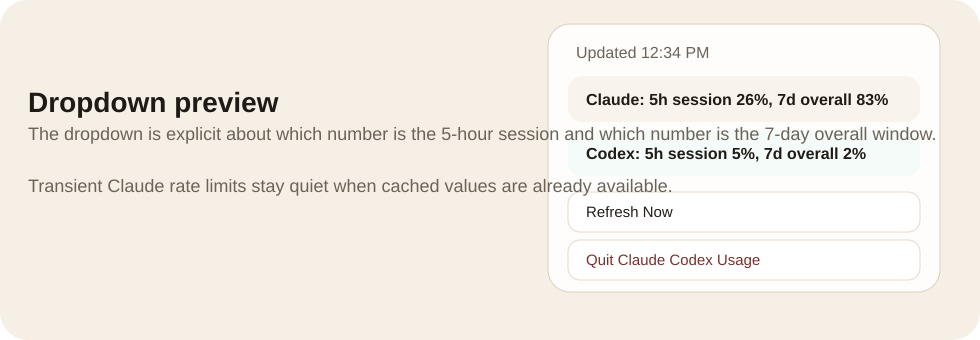

<div align="center">

# Claude Codex Usage

Menu bar telemetry for Claude and Codex.

Native macOS status item. Shared core. Modular bundles. Quiet adaptive refresh.

<p>
  
</p>

<p>
  <strong>One codebase</strong> for <code>Claude Codex Usage.app</code>, <code>Claude Usage.app</code>, and <code>Codex Usage.app</code>.
</p>

</div>

## Quick install on Mac

The easiest install path is:

1. Download this repo as a ZIP and open it.
2. Double-click [install.command](install.command).
3. Press `Return` to install `Claude Codex Usage` by default, or choose:
   - `Claude Codex Usage` (default, Claude + Codex)
   - `Claude Usage`
   - `Codex Usage`
   - or all three

The installer will:

- build the apps
- copy the selected bundle into `/Applications`
- replace any existing copy
- launch the installed app

If macOS warns that the app is unsigned, right-click it once in `/Applications` and choose `Open`.

Or install with Homebrew:

```bash
brew tap ShipItAndPray/claude-codex-usage
brew install --cask claude-codex-usage
```

Optional variants:

```bash
brew install --cask claude-codex-usage-claude
brew install --cask claude-codex-usage-codex
```

## What it is

Claude Codex Usage puts the only numbers people actually care about in the macOS menu bar:

- Claude `5h` session usage
- Claude `7d` overall usage
- Codex `5h` session usage
- Codex `7d` overall usage

The app is built to stay visible, fast, and quiet:

- Claude is a scarce network source, so it refreshes adaptively and backs off hard after `429`
- Codex is a local source, so it refreshes much more often
- transient Claude failures keep the last known good numbers instead of wiping the UI
- the same core app can ship as combined, Claude-only, or Codex-only

## Why the design is different

Most usage widgets are noisy in exactly the wrong places:

- they show too much copy in the menu bar
- they treat local and network sources the same
- they wipe values when a provider has a temporary failure
- they force one bundle shape on everyone

Claude Codex Usage takes the opposite approach:

- the menu bar stays dense and glanceable
- the dropdown is explicit and descriptive
- Claude failures degrade silently when a cached value exists
- install only the provider you actually use

## Bundles

| Bundle | Purpose | Data sources |
| --- | --- | --- |
| `Claude Codex Usage.app` | Combined install for people using both services | Claude usage endpoint + local Codex session logs |
| `Claude Usage.app` | Claude-only install | Claude usage endpoint |
| `Codex Usage.app` | Codex-only install | local Codex session logs |

## Preview

### Menu bar


### Dropdown



The dropdown spells out the meaning of each number so nobody has to remember whether `2% 1%` means session, weekly, or something else.

## Refresh strategy

This is the core product behavior.

### Claude

- healthy cadence is adaptive, not fixed
- high usage or a nearby reset pulls sooner
- low usage pulls less often
- `429` triggers a much longer retry window
- last good values stay on screen during transient failures

Current target behavior:

- healthy Claude cadence: about `5-10 minutes`
- Claude after `429`: `15 minutes`, then `30 minutes`, then `60 minutes`

### Codex

- Codex reads local session logs
- recent active sessions refresh aggressively
- older sessions back off naturally

Current target behavior:

- active Codex cadence: about `20 seconds`

## Why this matters

The point is not just correctness. It is trust.

If a menu bar app flickers, disappears, or screams about provider throttles, people stop believing the numbers. This app is designed to do the boring thing correctly in the background so the foreground stays stable.

## Build

```bash
cd usage-menu-bar-app
./build.sh
```

Build output:

- `build/Claude Codex Usage.app`
- `build/Claude Usage.app`
- `build/Codex Usage.app`

## Run

```bash
./run.sh
./run-claude.sh
./run-codex.sh
```

## Installer scripts

For terminal-based installs:

```bash
./install.sh
./install.sh combined
./install.sh claude
./install.sh codex
./install.sh all
```

## Demo

A static GitHub Pages-ready demo lives in [docs/index.html](docs/index.html).

The demo shows:

- combined app state
- quiet Claude backoff behavior
- Claude-only install
- Codex-only install

## Architecture

- [Sources/ClaudeCodexUsage/main.swift](Sources/ClaudeCodexUsage/main.swift): native app and refresh logic
- [build.sh](build.sh): produces all three app bundles from the same source tree
- [docs/index.html](docs/index.html): repo demo page
- [autoresearch-claude-codex-usage-refresh/refresh-policy-v2.md](autoresearch-claude-codex-usage-refresh/refresh-policy-v2.md): evaluated refresh policy that won the refinement loop
- [autoresearch-claude-codex-usage-refresh/results.tsv](autoresearch-claude-codex-usage-refresh/results.tsv): baseline vs candidate scores

## Refinement notes

The Claude refresh behavior was tightened with a small local eval loop instead of guessing intervals by feel.

Baseline:

- score `2/5`

Winning candidate:

- score `5/5`

Artifacts:

- [refresh-policy-v2.md](autoresearch-claude-codex-usage-refresh/refresh-policy-v2.md)
- [results.tsv](autoresearch-claude-codex-usage-refresh/results.tsv)
- [changelog.md](autoresearch-claude-codex-usage-refresh/changelog.md)

## Status

This repo is set up so the next provider can be added as another service configuration, not another app rewrite.
